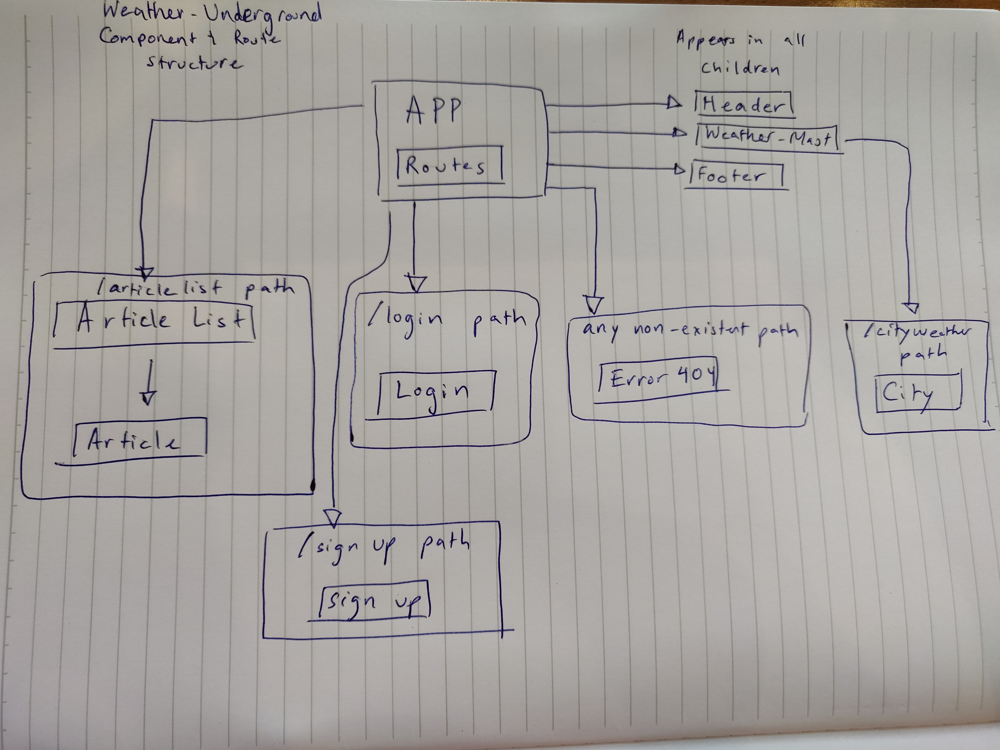

# _Weather Underground React Clone_

#### By _**Dino Nguyen**_

## Description

_This is a clone of the Weather Underground website created with React._

-The differences with Angular and React include:
-  no dependency injection and using JSX instead of templates for React
- CSS encapsulation for Angular

## Component Tree

## Development Notes and Questions

- I am implementing the Dark Sky API into my app. I assume it is a similar process to what we've learned.

## Setup/Installation Requirements

* _Run `git clone https://github.com/dinowins/weather-underground-react` in your terminal of choice_
* _Navigate to where you put the folder inside your terminal and run `npm install`_
* _After the install is complete you can run `npm run start` to see a live version of the website._

* _DO NOT TOUCH THE `Webpack-dev-server` dependency unless you know what your doing. If you update it there will be errors that break the application!_

## Known Bugs

_If you run `npm run lint` on pc you will get `Expected linebreaks to be 'LF' but found 'CRLF'`. It doesn't break the code and will still run correctly when you run `npm run start`_

## Support and contact details

_Please contact Dino Nguyen at dinodnguyen@gmail.com_

## Technologies Used

_scss_
_Webpack_
_React_
_eslint_
_AOS_

### License

*This Software is Licensed under the MIT License.*

Copyright (c) 2019 **_Dino Nguyen_**
